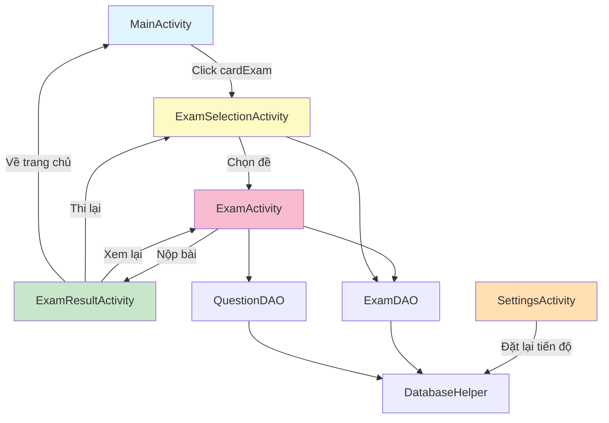
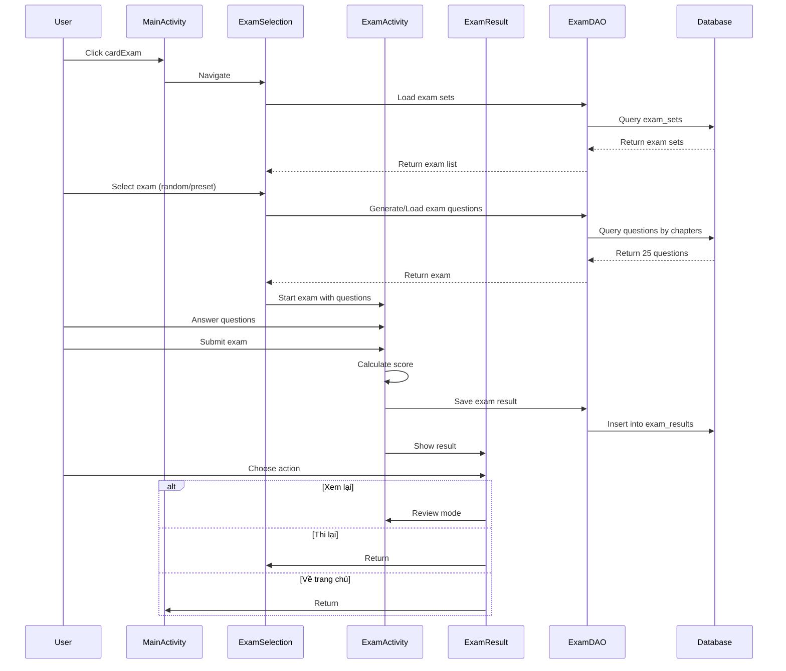

# Design Document: Exam Mode Feature

## Overview

Tính năng Exam Mode (Thi thử bằng lái xe) cho phép người dùng thực hành thi thử với đề thi giống như kỳ thi GPLX thật. Hệ thống bao gồm 4 màn hình chính: ExamSelectionActivity (chọn đề), ExamActivity (làm bài thi), ExamResultActivity (xem kết quả), và cải thiện SettingsActivity (đặt lại tiến độ). Đề thi có 25 câu hỏi được phân bố theo 5 chương, với timer 19 phút và quy tắc chấm điểm theo hạng bằng (A hoặc A1). Hệ thống lưu trữ 15 đề thi có sẵn và hỗ trợ tạo đề ngẫu nhiên.

## Architecture



## Main Workflow




## Components and Interfaces

### Component 1: ExamSelectionActivity

**Purpose**: Màn hình chọn đề thi, hiển thị 15 đề có sẵn + nút đề ngẫu nhiên, toggle "Hiện đáp án ngay"

**Interface**:
```java
public class ExamSelectionActivity extends AppCompatActivity {
    // UI Components
    private TextView tvLicenseType;
    private SwitchCompat switchShowAnswerImmediately;
    private Button btnRandomExam;
    private GridLayout gridExamButtons;
    
    // Data
    private ExamDAO examDAO;
    private String currentLicenseType;
    private boolean showAnswerImmediately;
    
    // Methods
    protected void onCreate(Bundle savedInstanceState);
    private void initViews();
    private void loadLicenseType();
    private void setupExamButtons();
    private void startExam(int examSetId, boolean isRandom);
    private void generateRandomExam();
}
```

**Responsibilities**:
- Hiển thị hạng bằng hiện tại (A hoặc A1)
- Hiển thị 15 nút đề thi có sẵn
- Xử lý nút "Đề ngẫu nhiên"
- Quản lý toggle "Hiện đáp án ngay"
- Khởi tạo ExamActivity với đề thi đã chọn

### Component 2: ExamActivity

**Purpose**: Màn hình làm bài thi, hiển thị 25 câu hỏi với timer đếm ngược

**Interface**:
```java
public class ExamActivity extends AppCompatActivity {
    // UI Components
    private TextView tvTimer;
    private TextView tvQuestionNumber;
    private TextView tvQuestion;
    private ImageView ivQuestion;
    private CardView cardOptionA, cardOptionB, cardOptionC, cardOptionD;
    private TextView tvOptionA, tvOptionB, tvOptionC, tvOptionD;
    private RecyclerView rvQuestionGrid;
    private Button btnSubmit;
    
    // Data
    private List<Question> examQuestions;
    private Map<Integer, String> userAnswers;
    private int currentQuestionIndex;
    private boolean showAnswerImmediately;
    private CountDownTimer timer;
    private long remainingTimeInMillis;
    private boolean isReviewMode;
    
    // Methods
    protected void onCreate(Bundle savedInstanceState);
    private void initViews();
    private void loadExamData();
    private void startTimer();
    private void displayQuestion(int index);
    private void selectAnswer(String answer);
    private void navigateToQuestion(int index);
    private void submitExam();
    private void calculateResult();
    private void showSubmitConfirmation();
}
```

**Responsibilities**:
- Hiển thị 25 câu hỏi theo thứ tự
- Quản lý timer đếm ngược 19 phút (1140 giây)
- Lưu câu trả lời của người dùng
- Hiển thị grid trạng thái 25 câu (đã làm/chưa làm)
- Xử lý chế độ "Hiện đáp án ngay" (highlight đúng/sai ngay khi chọn)
- Xử lý nút "Nộp bài"
- Tính điểm và chuyển sang ExamResultActivity
- Hỗ trợ chế độ xem lại (review mode)

### Component 3: ExamResultActivity

**Purpose**: Màn hình hiển thị kết quả thi, danh sách câu sai, và các tùy chọn tiếp theo

**Interface**:
```java
public class ExamResultActivity extends AppCompatActivity {
    // UI Components
    private TextView tvResultStatus;
    private TextView tvScore;
    private TextView tvTime;
    private RecyclerView rvWrongAnswers;
    private Button btnReview;
    private Button btnRetake;
    private Button btnHome;
    
    // Data
    private ExamResult examResult;
    private List<Question> examQuestions;
    private Map<Integer, String> userAnswers;
    
    // Methods
    protected void onCreate(Bundle savedInstanceState);
    private void initViews();
    private void loadResultData();
    private void displayResult();
    private void displayWrongAnswers();
    private void reviewExam();
    private void retakeExam();
    private void goHome();
}
```

**Responsibilities**:
- Hiển thị kết quả ĐẠT/TRƯỢT
- Hiển thị số câu đúng/tổng số câu
- Hiển thị thời gian hoàn thành
- Hiển thị danh sách câu sai (nếu có)
- Xử lý nút "Xem lại đáp án" (mở ExamActivity ở chế độ review)
- Xử lý nút "Thi lại" (quay về ExamSelectionActivity)
- Xử lý nút "Về trang chủ" (quay về MainActivity)

### Component 4: ExamDAO

**Purpose**: Data Access Object quản lý đề thi và kết quả thi

**Interface**:
```java
public class ExamDAO {
    private DatabaseHelper dbHelper;
    private QuestionDAO questionDAO;
    
    // Constructor
    public ExamDAO(Context context);
    
    // Exam Set Management
    public void initializeExamSets();
    public List<ExamSet> getAllExamSets();
    public ExamSet getExamSetById(int examSetId);
    
    // Exam Generation
    public List<Question> generateRandomExam(String licenseType);
    public List<Question> getExamQuestions(int examSetId);
    
    // Exam Result Management
    public long saveExamResult(ExamResult result);
    public List<ExamResult> getExamHistory();
    public ExamResult getExamResultById(long resultId);
    
    // Helper Methods
    private List<Question> selectQuestionsByChapter(String chapter, int count, boolean requireCritical);
    private boolean validateExamStructure(List<Question> questions);
    
    public void close();
}
```

**Responsibilities**:
- Khởi tạo 15 đề thi có sẵn vào database
- Tạo đề thi ngẫu nhiên theo cấu trúc chuẩn
- Lấy câu hỏi cho đề thi cụ thể
- Lưu kết quả thi vào database
- Lấy lịch sử thi
- Validate cấu trúc đề thi (25 câu, phân bố đúng, có câu điểm liệt)


## Data Models

### Model 1: ExamSet

```java
public class ExamSet {
    private int id;                    // 1-15 for preset exams, 0 for random
    private String name;               // "Đề 1", "Đề 2", ..., "Đề ngẫu nhiên"
    private String questionIds;        // Comma-separated question IDs: "1,5,12,..."
    private long createdAt;            // Timestamp
    
    // Constructors
    public ExamSet();
    public ExamSet(int id, String name, String questionIds, long createdAt);
    
    // Getters and Setters
    public int getId();
    public void setId(int id);
    public String getName();
    public void setName(String name);
    public String getQuestionIds();
    public void setQuestionIds(String questionIds);
    public long getCreatedAt();
    public void setCreatedAt(long createdAt);
    
    // Helper Methods
    public List<Integer> getQuestionIdList();
    public void setQuestionIdList(List<Integer> ids);
}
```

**Validation Rules**:
- id: 0-15 (0 = random, 1-15 = preset)
- name: không được null hoặc rỗng
- questionIds: phải chứa đúng 25 IDs, phân cách bằng dấu phẩy

### Model 2: ExamResult

```java
public class ExamResult {
    private long id;                   // Auto-increment primary key
    private int examSetId;             // Reference to exam_sets.id
    private String licenseType;        // "A" or "A1"
    private int totalQuestions;        // Always 25
    private int correctAnswers;        // Number of correct answers
    private int wrongAnswers;          // Number of wrong answers
    private boolean hasCriticalError;  // True if failed critical question
    private boolean passed;            // True if passed
    private long timeSpent;            // Time in seconds
    private String userAnswers;        // JSON: {"1":"A","2":"B",...}
    private long timestamp;            // When exam was taken
    
    // Constructors
    public ExamResult();
    public ExamResult(int examSetId, String licenseType, int totalQuestions,
                     int correctAnswers, int wrongAnswers, boolean hasCriticalError,
                     boolean passed, long timeSpent, String userAnswers, long timestamp);
    
    // Getters and Setters
    public long getId();
    public void setId(long id);
    public int getExamSetId();
    public void setExamSetId(int examSetId);
    public String getLicenseType();
    public void setLicenseType(String licenseType);
    public int getTotalQuestions();
    public void setTotalQuestions(int totalQuestions);
    public int getCorrectAnswers();
    public void setCorrectAnswers(int correctAnswers);
    public int getWrongAnswers();
    public void setWrongAnswers(int wrongAnswers);
    public boolean isHasCriticalError();
    public void setHasCriticalError(boolean hasCriticalError);
    public boolean isPassed();
    public void setPassed(boolean passed);
    public long getTimeSpent();
    public void setTimeSpent(long timeSpent);
    public String getUserAnswers();
    public void setUserAnswers(String userAnswers);
    public long getTimestamp();
    public void setTimestamp(long timestamp);
    
    // Helper Methods
    public Map<Integer, String> getUserAnswersMap();
    public void setUserAnswersMap(Map<Integer, String> answers);
    public int getScore();
}
```

**Validation Rules**:
- examSetId: 0-15
- licenseType: "A" hoặc "A1"
- totalQuestions: luôn = 25
- correctAnswers: 0-25
- wrongAnswers: 0-25
- correctAnswers + wrongAnswers = totalQuestions
- timeSpent: 0-1140 (tối đa 19 phút)
- userAnswers: JSON hợp lệ với 25 entries

### Model 3: QuestionGridItem

```java
public class QuestionGridItem {
    private int questionNumber;        // 1-25
    private boolean isAnswered;        // True if user selected an answer
    private boolean isCurrent;         // True if this is current question
    
    // Constructors
    public QuestionGridItem(int questionNumber, boolean isAnswered, boolean isCurrent);
    
    // Getters and Setters
    public int getQuestionNumber();
    public void setQuestionNumber(int questionNumber);
    public boolean isAnswered();
    public void setAnswered(boolean answered);
    public boolean isCurrent();
    public void setCurrent(boolean current);
}
```

**Validation Rules**:
- questionNumber: 1-25


## Database Schema

### Table: exam_sets

```sql
CREATE TABLE exam_sets (
    id INTEGER PRIMARY KEY,
    name TEXT NOT NULL,
    question_ids TEXT NOT NULL,
    created_at INTEGER DEFAULT (strftime('%s', 'now'))
);
```

**Columns**:
- `id`: 1-15 (preset exam IDs)
- `name`: "Đề 1", "Đề 2", ..., "Đề 15"
- `question_ids`: Comma-separated list of 25 question IDs
- `created_at`: Unix timestamp

**Indexes**:
- PRIMARY KEY on `id`

### Table: exam_results

```sql
CREATE TABLE exam_results (
    id INTEGER PRIMARY KEY AUTOINCREMENT,
    exam_set_id INTEGER NOT NULL,
    license_type TEXT NOT NULL,
    total_questions INTEGER NOT NULL DEFAULT 25,
    correct_answers INTEGER NOT NULL,
    wrong_answers INTEGER NOT NULL,
    has_critical_error INTEGER NOT NULL DEFAULT 0,
    passed INTEGER NOT NULL DEFAULT 0,
    time_spent INTEGER NOT NULL,
    user_answers TEXT NOT NULL,
    timestamp INTEGER DEFAULT (strftime('%s', 'now')),
    FOREIGN KEY (exam_set_id) REFERENCES exam_sets(id)
);
```

**Columns**:
- `id`: Auto-increment primary key
- `exam_set_id`: Reference to exam_sets.id (0 for random)
- `license_type`: "A" or "A1"
- `total_questions`: Always 25
- `correct_answers`: Number of correct answers (0-25)
- `wrong_answers`: Number of wrong answers (0-25)
- `has_critical_error`: 1 if failed critical question, 0 otherwise
- `passed`: 1 if passed, 0 if failed
- `time_spent`: Time in seconds (0-1140)
- `user_answers`: JSON string: {"1":"A","2":"B",...}
- `timestamp`: Unix timestamp when exam was taken

**Indexes**:
- PRIMARY KEY on `id`
- INDEX on `timestamp` for sorting history
- FOREIGN KEY on `exam_set_id`

### Database Upgrade

Update `DatabaseHelper.java`:
- Increment `DATABASE_VERSION` to 4
- Add `onUpgrade` logic to create new tables

```java
@Override
public void onUpgrade(SQLiteDatabase db, int oldVersion, int newVersion) {
    if (oldVersion < 3) {
        createBookmarksTable(db);
    }
    if (oldVersion < 4) {
        createExamTables(db);
    }
}

private void createExamTables(SQLiteDatabase db) {
    // Create exam_sets table
    db.execSQL("CREATE TABLE IF NOT EXISTS exam_sets ("
            + "id INTEGER PRIMARY KEY,"
            + "name TEXT NOT NULL,"
            + "question_ids TEXT NOT NULL,"
            + "created_at INTEGER DEFAULT (strftime('%s', 'now'))"
            + ")");
    
    // Create exam_results table
    db.execSQL("CREATE TABLE IF NOT EXISTS exam_results ("
            + "id INTEGER PRIMARY KEY AUTOINCREMENT,"
            + "exam_set_id INTEGER NOT NULL,"
            + "license_type TEXT NOT NULL,"
            + "total_questions INTEGER NOT NULL DEFAULT 25,"
            + "correct_answers INTEGER NOT NULL,"
            + "wrong_answers INTEGER NOT NULL,"
            + "has_critical_error INTEGER NOT NULL DEFAULT 0,"
            + "passed INTEGER NOT NULL DEFAULT 0,"
            + "time_spent INTEGER NOT NULL,"
            + "user_answers TEXT NOT NULL,"
            + "timestamp INTEGER DEFAULT (strftime('%s', 'now')),"
            + "FOREIGN KEY (exam_set_id) REFERENCES exam_sets(id)"
            + ")");
    
    // Create index on timestamp
    db.execSQL("CREATE INDEX IF NOT EXISTS idx_exam_results_timestamp "
            + "ON exam_results(timestamp)");
}
```


## Key Functions with Formal Specifications

### Function 1: generateRandomExam()

```java
public List<Question> generateRandomExam(String licenseType)
```

**Preconditions:**
- `licenseType` is non-null and equals "A" or "A1"
- Database contains sufficient questions in each chapter
- At least 1 critical question exists in the database

**Postconditions:**
- Returns list of exactly 25 Question objects
- Questions are distributed: 7 from Chapter 1, 1 from Chapter 2, 2 from Chapter 3, 10 from Chapter 4, 5 from Chapter 5
- At least 1 question in the list has `isCritical() == true`
- All questions are unique (no duplicates)
- Questions are randomly selected from their respective chapters

**Loop Invariants:**
- For each chapter selection loop: all previously selected questions are unique
- Total question count never exceeds 25

### Function 2: calculateExamResult()

```java
private ExamResult calculateExamResult(List<Question> questions, Map<Integer, String> userAnswers, String licenseType, long timeSpent)
```

**Preconditions:**
- `questions` is non-null and contains exactly 25 Question objects
- `userAnswers` is non-null (may be empty or partial)
- `licenseType` is "A" or "A1"
- `timeSpent` is >= 0 and <= 1140 (19 minutes in seconds)

**Postconditions:**
- Returns valid ExamResult object
- `result.getTotalQuestions() == 25`
- `result.getCorrectAnswers() + result.getWrongAnswers() == number of answered questions`
- `result.isPassed() == true` if and only if:
  - `result.isHasCriticalError() == false` AND
  - (licenseType == "A" AND wrongAnswers <= 2) OR (licenseType == "A1" AND wrongAnswers <= 4)
- `result.getTimeSpent() == timeSpent`

**Loop Invariants:**
- For answer checking loop: correctCount + wrongCount == number of processed answers
- hasCriticalError remains false until a critical question is answered incorrectly

### Function 3: selectQuestionsByChapter()

```java
private List<Question> selectQuestionsByChapter(String chapter, int count, boolean requireCritical)
```

**Preconditions:**
- `chapter` is non-null and valid chapter name
- `count` is positive integer
- Database contains at least `count` questions in the specified chapter
- If `requireCritical == true`, at least 1 critical question exists in the chapter

**Postconditions:**
- Returns list of exactly `count` Question objects
- All questions belong to the specified chapter
- All questions are unique
- If `requireCritical == true`, at least 1 question has `isCritical() == true`
- Questions are randomly selected

**Loop Invariants:**
- Selected questions set size <= count
- All questions in selected set are unique

### Function 4: validateExamStructure()

```java
private boolean validateExamStructure(List<Question> questions)
```

**Preconditions:**
- `questions` is non-null (may be empty)

**Postconditions:**
- Returns `true` if and only if:
  - `questions.size() == 25`
  - Chapter distribution is correct (7, 1, 2, 10, 5)
  - At least 1 question has `isCritical() == true`
  - All question IDs are unique
- Returns `false` otherwise
- No side effects on input list

**Loop Invariants:**
- For chapter counting loop: sum of chapter counts <= 25
- For uniqueness check loop: all previously checked IDs are unique


## Algorithmic Pseudocode

### Main Exam Generation Algorithm

```java
ALGORITHM generateRandomExam(licenseType)
INPUT: licenseType of type String ("A" or "A1")
OUTPUT: examQuestions of type List<Question>

BEGIN
  ASSERT licenseType != null AND (licenseType.equals("A") OR licenseType.equals("A1"))
  
  // Initialize result list
  examQuestions ← new ArrayList<Question>()
  
  // Step 1: Select 7 questions from Chapter 1 (Q1-100) with at least 1 critical
  chapter1Questions ← selectQuestionsByChapter("Quy định chung và quy tắc giao thông đường bộ", 7, true)
  examQuestions.addAll(chapter1Questions)
  
  // Step 2: Select 1 question from Chapter 2 (Q101-110)
  chapter2Questions ← selectQuestionsByChapter("Văn hóa giao thông, đạo đức người lái xe", 1, false)
  examQuestions.addAll(chapter2Questions)
  
  // Step 3: Select 2 questions from Chapter 3 (Q111-125)
  chapter3Questions ← selectQuestionsByChapter("Kỹ thuật lái xe", 2, false)
  examQuestions.addAll(chapter3Questions)
  
  // Step 4: Select 10 questions from Chapter 4 (Q126-215)
  chapter4Questions ← selectQuestionsByChapter("Biển báo đường bộ", 10, false)
  examQuestions.addAll(chapter4Questions)
  
  // Step 5: Select 5 questions from Chapter 5 (Q216-250)
  chapter5Questions ← selectQuestionsByChapter("Sa hình", 5, false)
  examQuestions.addAll(chapter5Questions)
  
  // Step 6: Validate exam structure
  ASSERT validateExamStructure(examQuestions) == true
  
  RETURN examQuestions
END
```

**Preconditions:**
- licenseType is "A" or "A1"
- Database has sufficient questions in each chapter
- At least 1 critical question exists

**Postconditions:**
- Returns exactly 25 questions
- Distribution: 7, 1, 2, 10, 5 across chapters
- At least 1 critical question included
- All questions are unique

**Loop Invariants:**
- examQuestions.size() increases by chapter count after each addAll
- All questions remain unique throughout

### Question Selection by Chapter Algorithm

```java
ALGORITHM selectQuestionsByChapter(chapter, count, requireCritical)
INPUT: chapter of type String, count of type int, requireCritical of type boolean
OUTPUT: selectedQuestions of type List<Question>

BEGIN
  ASSERT chapter != null AND count > 0
  
  // Step 1: Get all questions from chapter
  allQuestions ← questionDAO.getQuestionsByCategory(chapter)
  ASSERT allQuestions.size() >= count
  
  // Step 2: Separate critical and non-critical questions
  criticalQuestions ← new ArrayList<Question>()
  nonCriticalQuestions ← new ArrayList<Question>()
  
  FOR each question IN allQuestions DO
    IF question.isCritical() THEN
      criticalQuestions.add(question)
    ELSE
      nonCriticalQuestions.add(question)
    END IF
  END FOR
  
  // Step 3: Select questions
  selectedQuestions ← new ArrayList<Question>()
  
  IF requireCritical AND criticalQuestions.size() > 0 THEN
    // Select 1 critical question
    randomIndex ← Random.nextInt(criticalQuestions.size())
    selectedQuestions.add(criticalQuestions.get(randomIndex))
    count ← count - 1
  END IF
  
  // Step 4: Shuffle and select remaining questions
  Collections.shuffle(allQuestions)
  
  FOR each question IN allQuestions DO
    IF selectedQuestions.size() >= count THEN
      BREAK
    END IF
    
    IF NOT selectedQuestions.contains(question) THEN
      selectedQuestions.add(question)
    END IF
  END FOR
  
  ASSERT selectedQuestions.size() == count
  RETURN selectedQuestions
END
```

**Preconditions:**
- chapter is valid chapter name
- count > 0
- Database has at least count questions in chapter
- If requireCritical, at least 1 critical question exists

**Postconditions:**
- Returns exactly count questions
- All questions from specified chapter
- If requireCritical, at least 1 critical question included
- All questions are unique

**Loop Invariants:**
- selectedQuestions.size() <= count
- All questions in selectedQuestions are unique

### Exam Result Calculation Algorithm

```java
ALGORITHM calculateExamResult(questions, userAnswers, licenseType, timeSpent)
INPUT: questions of type List<Question>, userAnswers of type Map<Integer,String>, 
       licenseType of type String, timeSpent of type long
OUTPUT: result of type ExamResult

BEGIN
  ASSERT questions != null AND questions.size() == 25
  ASSERT userAnswers != null
  ASSERT licenseType.equals("A") OR licenseType.equals("A1")
  ASSERT timeSpent >= 0 AND timeSpent <= 1140
  
  // Initialize counters
  correctCount ← 0
  wrongCount ← 0
  hasCriticalError ← false
  
  // Step 1: Check each answer
  FOR i FROM 0 TO questions.size() - 1 DO
    question ← questions.get(i)
    questionId ← question.getId()
    
    IF userAnswers.containsKey(questionId) THEN
      userAnswer ← userAnswers.get(questionId)
      correctAnswer ← question.getCorrectAnswer()
      
      IF userAnswer.equals(correctAnswer) THEN
        correctCount ← correctCount + 1
      ELSE
        wrongCount ← wrongCount + 1
        
        // Check if critical question failed
        IF question.isCritical() THEN
          hasCriticalError ← true
        END IF
      END IF
    END IF
  END FOR
  
  // Step 2: Determine pass/fail
  passed ← false
  
  IF NOT hasCriticalError THEN
    IF licenseType.equals("A") AND wrongCount <= 2 THEN
      passed ← true
    ELSE IF licenseType.equals("A1") AND wrongCount <= 4 THEN
      passed ← true
    END IF
  END IF
  
  // Step 3: Create result object
  result ← new ExamResult()
  result.setTotalQuestions(25)
  result.setCorrectAnswers(correctCount)
  result.setWrongAnswers(wrongCount)
  result.setHasCriticalError(hasCriticalError)
  result.setPassed(passed)
  result.setTimeSpent(timeSpent)
  result.setLicenseType(licenseType)
  
  RETURN result
END
```

**Preconditions:**
- questions has exactly 25 elements
- userAnswers is not null
- licenseType is "A" or "A1"
- timeSpent is between 0 and 1140

**Postconditions:**
- result.totalQuestions == 25
- result.correctAnswers + result.wrongAnswers == number of answered questions
- result.passed is true only if no critical errors AND wrong count within limit
- result.timeSpent == timeSpent

**Loop Invariants:**
- correctCount + wrongCount == number of processed answers
- hasCriticalError can only change from false to true, never back


### Exam Structure Validation Algorithm

```java
ALGORITHM validateExamStructure(questions)
INPUT: questions of type List<Question>
OUTPUT: isValid of type boolean

BEGIN
  // Check total count
  IF questions == null OR questions.size() != 25 THEN
    RETURN false
  END IF
  
  // Initialize chapter counters
  chapterCounts ← new HashMap<String, Integer>()
  chapterCounts.put("Quy định chung và quy tắc giao thông đường bộ", 0)
  chapterCounts.put("Văn hóa giao thông, đạo đức người lái xe", 0)
  chapterCounts.put("Kỹ thuật lái xe", 0)
  chapterCounts.put("Biển báo đường bộ", 0)
  chapterCounts.put("Sa hình", 0)
  
  hasCritical ← false
  questionIds ← new HashSet<Integer>()
  
  // Step 1: Count questions by chapter and check for duplicates
  FOR each question IN questions DO
    // Check for duplicates
    IF questionIds.contains(question.getId()) THEN
      RETURN false
    END IF
    questionIds.add(question.getId())
    
    // Count by chapter
    category ← question.getCategory()
    IF chapterCounts.containsKey(category) THEN
      count ← chapterCounts.get(category)
      chapterCounts.put(category, count + 1)
    END IF
    
    // Check for critical question
    IF question.isCritical() THEN
      hasCritical ← true
    END IF
  END FOR
  
  // Step 2: Validate chapter distribution
  IF chapterCounts.get("Quy định chung và quy tắc giao thông đường bộ") != 7 THEN
    RETURN false
  END IF
  
  IF chapterCounts.get("Văn hóa giao thông, đạo đức người lái xe") != 1 THEN
    RETURN false
  END IF
  
  IF chapterCounts.get("Kỹ thuật lái xe") != 2 THEN
    RETURN false
  END IF
  
  IF chapterCounts.get("Biển báo đường bộ") != 10 THEN
    RETURN false
  END IF
  
  IF chapterCounts.get("Sa hình") != 5 THEN
    RETURN false
  END IF
  
  // Step 3: Check for at least 1 critical question
  IF NOT hasCritical THEN
    RETURN false
  END IF
  
  RETURN true
END
```

**Preconditions:**
- questions parameter is provided (may be null)

**Postconditions:**
- Returns true if and only if all validation rules pass
- No side effects on input list

**Loop Invariants:**
- questionIds contains all previously processed question IDs
- All IDs in questionIds are unique
- Chapter counts are accurate for all processed questions

### Reset Progress Algorithm (SettingsActivity Enhancement)

```java
ALGORITHM resetProgress()
INPUT: none
OUTPUT: success of type boolean

BEGIN
  TRY
    // Step 1: Clear history table
    historyDAO.clearHistory()
    
    // Step 2: Clear bookmarks table
    db ← dbHelper.getWritableDatabase()
    db.delete(TABLE_BOOKMARKS, null, null)
    
    // Step 3: Clear exam results table
    db.delete(TABLE_EXAM_RESULTS, null, null)
    
    // Step 4: Reset settings to default
    prefs ← getSharedPreferences("app_prefs", MODE_PRIVATE)
    editor ← prefs.edit()
    editor.putString("license_type", "A1")
    editor.putBoolean("dark_mode", false)
    editor.remove("questions_imported")
    editor.apply()
    
    // Step 5: Apply default theme
    AppCompatDelegate.setDefaultNightMode(AppCompatDelegate.MODE_NIGHT_NO)
    
    RETURN true
    
  CATCH Exception e
    Log.e("SettingsActivity", "Error resetting progress", e)
    RETURN false
  END TRY
END
```

**Preconditions:**
- Database is accessible
- SharedPreferences is accessible

**Postconditions:**
- All history records deleted
- All bookmarks deleted
- All exam results deleted
- Settings reset to: license_type="A1", dark_mode=false
- questions_imported flag removed
- Theme set to light mode
- Returns true if all operations succeed, false otherwise

**Loop Invariants:** N/A (no loops)


## Example Usage

### Example 1: Generate Random Exam

```java
// In ExamSelectionActivity
ExamDAO examDAO = new ExamDAO(this);
SharedPreferences prefs = getSharedPreferences("app_prefs", MODE_PRIVATE);
String licenseType = prefs.getString("license_type", "A1");

// Generate random exam
List<Question> examQuestions = examDAO.generateRandomExam(licenseType);

// Validate structure
if (examQuestions.size() == 25) {
    // Start exam activity
    Intent intent = new Intent(this, ExamActivity.class);
    intent.putExtra("exam_set_id", 0); // 0 = random
    intent.putExtra("show_answer_immediately", showAnswerImmediately);
    intent.putParcelableArrayListExtra("questions", new ArrayList<>(examQuestions));
    startActivity(intent);
}
```

### Example 2: Calculate Exam Result

```java
// In ExamActivity - after user submits exam
Map<Integer, String> userAnswers = new HashMap<>();
userAnswers.put(1, "A");
userAnswers.put(2, "B");
// ... (25 answers total)

long timeSpent = (1140000 - remainingTimeInMillis) / 1000; // Convert to seconds
String licenseType = getSharedPreferences("app_prefs", MODE_PRIVATE)
                        .getString("license_type", "A1");

ExamResult result = calculateExamResult(examQuestions, userAnswers, licenseType, timeSpent);

// Save result
ExamDAO examDAO = new ExamDAO(this);
long resultId = examDAO.saveExamResult(result);

// Navigate to result screen
Intent intent = new Intent(this, ExamResultActivity.class);
intent.putExtra("result_id", resultId);
intent.putParcelableArrayListExtra("questions", new ArrayList<>(examQuestions));
intent.putExtra("user_answers", new HashMap<>(userAnswers));
startActivity(intent);
```

### Example 3: Display Exam Result

```java
// In ExamResultActivity
long resultId = getIntent().getLongExtra("result_id", -1);
ExamDAO examDAO = new ExamDAO(this);
ExamResult result = examDAO.getExamResultById(resultId);

// Display result
if (result.isPassed()) {
    tvResultStatus.setText("ĐẠT");
    tvResultStatus.setTextColor(Color.GREEN);
} else {
    tvResultStatus.setText("TRƯỢT");
    tvResultStatus.setTextColor(Color.RED);
}

tvScore.setText(result.getCorrectAnswers() + "/25 câu đúng");
tvTime.setText("Thời gian: " + formatTime(result.getTimeSpent()));

// Show reason for failure
if (result.isHasCriticalError()) {
    tvFailReason.setText("Lý do: Sai câu điểm liệt");
} else if (!result.isPassed()) {
    tvFailReason.setText("Lý do: Sai quá " + 
        (result.getLicenseType().equals("A") ? "2" : "4") + " câu");
}
```

### Example 4: Reset Progress

```java
// In SettingsActivity - enhanced reset dialog
private void showResetDialog() {
    new AlertDialog.Builder(this)
        .setTitle("Đặt lại tiến độ")
        .setMessage("Bạn có chắc chắn muốn đặt lại toàn bộ tiến độ?\n\n" +
                "Hành động này sẽ:\n" +
                "• Xóa toàn bộ lịch sử trả lời\n" +
                "• Xóa toàn bộ bookmarks\n" +
                "• Xóa kết quả thi thử\n" +
                "• Reset cài đặt về mặc định (A1, chế độ sáng)\n" +
                "• Cho phép import lại câu hỏi\n\n" +
                "Hành động này không thể hoàn tác.")
        .setPositiveButton("Đặt lại", (dialog, which) -> {
            if (resetProgress()) {
                Toast.makeText(this, "Đã đặt lại tiến độ thành công", Toast.LENGTH_SHORT).show();
                finish();
            } else {
                Toast.makeText(this, "Lỗi khi đặt lại tiến độ", Toast.LENGTH_SHORT).show();
            }
        })
        .setNegativeButton("Hủy", null)
        .show();
}

private boolean resetProgress() {
    try {
        // Clear history
        HistoryDAO historyDAO = new HistoryDAO(this);
        historyDAO.clearHistory();
        
        // Clear bookmarks
        DatabaseHelper dbHelper = new DatabaseHelper(this);
        SQLiteDatabase db = dbHelper.getWritableDatabase();
        db.delete(DatabaseHelper.TABLE_BOOKMARKS, null, null);
        
        // Clear exam results
        db.delete("exam_results", null, null);
        
        // Reset settings
        SharedPreferences prefs = getSharedPreferences("app_prefs", MODE_PRIVATE);
        prefs.edit()
            .putString("license_type", "A1")
            .putBoolean("dark_mode", false)
            .remove("questions_imported")
            .apply();
        
        // Apply default theme
        AppCompatDelegate.setDefaultNightMode(AppCompatDelegate.MODE_NIGHT_NO);
        
        return true;
    } catch (Exception e) {
        Log.e("SettingsActivity", "Error resetting progress", e);
        return false;
    }
}
```

### Example 5: Timer Management in ExamActivity

```java
// In ExamActivity
private void startTimer() {
    timer = new CountDownTimer(1140000, 1000) { // 19 minutes, tick every second
        @Override
        public void onTick(long millisUntilFinished) {
            remainingTimeInMillis = millisUntilFinished;
            updateTimerDisplay();
        }
        
        @Override
        public void onFinish() {
            // Auto-submit when time runs out
            Toast.makeText(ExamActivity.this, "Hết giờ! Tự động nộp bài", Toast.LENGTH_SHORT).show();
            submitExam();
        }
    }.start();
}

private void updateTimerDisplay() {
    long minutes = (remainingTimeInMillis / 1000) / 60;
    long seconds = (remainingTimeInMillis / 1000) % 60;
    
    String timeText = String.format("%02d:%02d", minutes, seconds);
    tvTimer.setText(timeText);
    
    // Change color when time is running low (< 2 minutes)
    if (remainingTimeInMillis < 120000) {
        tvTimer.setTextColor(Color.RED);
    }
}
```


## Correctness Properties

### Property 1: Exam Structure Validity

**Universal Quantification:**
```
∀ exam ∈ GeneratedExams:
  exam.size() = 25 ∧
  count(exam, Chapter1) = 7 ∧
  count(exam, Chapter2) = 1 ∧
  count(exam, Chapter3) = 2 ∧
  count(exam, Chapter4) = 10 ∧
  count(exam, Chapter5) = 5 ∧
  ∃ q ∈ exam: q.isCritical() = true ∧
  ∀ q1, q2 ∈ exam: q1 ≠ q2 ⟹ q1.id ≠ q2.id
```

**Meaning:** Every generated exam must have exactly 25 questions with correct chapter distribution (7-1-2-10-5), at least one critical question, and all unique questions.

### Property 2: Scoring Correctness

**Universal Quantification:**
```
∀ result ∈ ExamResults:
  result.correctAnswers + result.wrongAnswers ≤ 25 ∧
  result.totalQuestions = 25 ∧
  (result.hasCriticalError = true ⟹ result.passed = false) ∧
  (result.passed = true ⟹ 
    result.hasCriticalError = false ∧
    ((result.licenseType = "A" ∧ result.wrongAnswers ≤ 2) ∨
     (result.licenseType = "A1" ∧ result.wrongAnswers ≤ 4)))
```

**Meaning:** Every exam result must have valid answer counts, exactly 25 total questions, fail if critical error exists, and pass only if no critical errors and wrong answers within license type limits.

### Property 3: Time Constraint

**Universal Quantification:**
```
∀ result ∈ ExamResults:
  0 ≤ result.timeSpent ≤ 1140
```

**Meaning:** Every exam result must have time spent between 0 and 1140 seconds (19 minutes).

### Property 4: Answer Uniqueness

**Universal Quantification:**
```
∀ exam ∈ ActiveExams, ∀ questionId ∈ exam.questions:
  |{answer ∈ exam.userAnswers: answer.questionId = questionId}| ≤ 1
```

**Meaning:** For every active exam, each question can have at most one user answer recorded.

### Property 5: Critical Question Requirement

**Universal Quantification:**
```
∀ exam ∈ GeneratedExams:
  ∃ q ∈ exam: q.isCritical() = true
```

**Meaning:** Every generated exam must contain at least one critical question.

### Property 6: License Type Validity

**Universal Quantification:**
```
∀ result ∈ ExamResults:
  result.licenseType ∈ {"A", "A1"}
```

**Meaning:** Every exam result must have a valid license type (either "A" or "A1").

### Property 7: Question ID Uniqueness in Exam

**Universal Quantification:**
```
∀ exam ∈ GeneratedExams:
  ∀ i, j ∈ [0, exam.size()): i ≠ j ⟹ exam[i].id ≠ exam[j].id
```

**Meaning:** Within any generated exam, all question IDs must be unique (no duplicate questions).

### Property 8: Chapter Distribution Invariant

**Universal Quantification:**
```
∀ exam ∈ GeneratedExams:
  let chapters = groupBy(exam, q ⟹ q.category)
  in sum(chapters.values().map(c ⟹ c.size())) = 25
```

**Meaning:** The sum of questions across all chapters in any exam must equal 25.

### Property 9: Reset Progress Completeness

**Universal Quantification:**
```
∀ system ∈ Systems:
  afterReset(system) ⟹
    system.history.isEmpty() ∧
    system.bookmarks.isEmpty() ∧
    system.examResults.isEmpty() ∧
    system.settings.licenseType = "A1" ∧
    system.settings.darkMode = false ∧
    system.settings.questionsImported = false
```

**Meaning:** After reset operation, all user data must be cleared and settings must return to defaults.

### Property 10: Exam Result Consistency

**Universal Quantification:**
```
∀ result ∈ ExamResults:
  result.correctAnswers = count({(qId, ans) ∈ result.userAnswers: 
    ans = getQuestion(qId).correctAnswer})
```

**Meaning:** The correct answer count in any exam result must equal the actual number of correctly answered questions.


## Error Handling

### Error Scenario 1: Insufficient Questions in Database

**Condition**: Database doesn't have enough questions in a specific chapter to generate exam
**Response**: 
- Log error with chapter name and required count
- Show Toast message: "Không đủ câu hỏi để tạo đề thi. Vui lòng kiểm tra dữ liệu."
- Return to ExamSelectionActivity
**Recovery**: 
- User should re-import questions or check database integrity
- Provide option to import questions from assets

### Error Scenario 2: No Critical Questions Available

**Condition**: Database has no critical questions when generating exam
**Response**:
- Log warning: "No critical questions found in database"
- Show Toast message: "Cảnh báo: Không tìm thấy câu điểm liệt trong cơ sở dữ liệu"
- Continue with exam generation but mark exam as invalid
**Recovery**:
- User should re-import questions
- Prevent exam from being submitted for official scoring

### Error Scenario 3: Timer Expires

**Condition**: User doesn't submit exam within 19 minutes
**Response**:
- Automatically call submitExam()
- Show Toast message: "Hết giờ! Tự động nộp bài"
- Calculate result with current answers (unanswered questions marked as wrong)
**Recovery**:
- Navigate to ExamResultActivity with partial results
- User can retake exam if desired

### Error Scenario 4: Database Write Failure

**Condition**: Failed to save exam result to database
**Response**:
- Log error with exception details
- Show AlertDialog: "Không thể lưu kết quả thi. Bạn có muốn thử lại?"
- Provide "Thử lại" and "Bỏ qua" options
**Recovery**:
- If "Thử lại": Attempt to save again
- If "Bỏ qua": Navigate to result screen without saving (temporary result only)

### Error Scenario 5: Invalid License Type

**Condition**: SharedPreferences returns invalid or null license type
**Response**:
- Log warning: "Invalid license type, defaulting to A1"
- Default to "A1"
- Show Toast message: "Đã đặt hạng bằng mặc định: A1"
**Recovery**:
- Continue with A1 license type
- User can change in SettingsActivity

### Error Scenario 6: Exam Set Not Found

**Condition**: User selects preset exam but exam_sets table is empty or exam ID doesn't exist
**Response**:
- Log error: "Exam set not found: " + examSetId
- Show Toast message: "Không tìm thấy đề thi. Đang tạo đề ngẫu nhiên..."
- Fall back to random exam generation
**Recovery**:
- Generate random exam instead
- Initialize exam sets if table is empty

### Error Scenario 7: Activity State Loss

**Condition**: ExamActivity is destroyed (e.g., screen rotation) while exam is in progress
**Response**:
- Save exam state in onSaveInstanceState():
  - Current question index
  - User answers map
  - Remaining time
  - Show answer immediately flag
- Restore state in onCreate() if savedInstanceState != null
**Recovery**:
- Restore exam to exact state before destruction
- Resume timer with remaining time

### Error Scenario 8: Invalid Question Data

**Condition**: Question object has null or empty required fields
**Response**:
- Log error: "Invalid question data: " + question.getId()
- Skip question in display
- Show placeholder: "Câu hỏi không hợp lệ"
- Mark question as invalid in exam
**Recovery**:
- Continue with remaining valid questions
- Adjust total question count in result calculation

### Error Scenario 9: JSON Parsing Error (User Answers)

**Condition**: Failed to parse userAnswers JSON string from database
**Response**:
- Log error with exception details
- Return empty HashMap
- Show Toast message: "Không thể tải câu trả lời"
**Recovery**:
- Display exam result without detailed answer review
- User can still see overall score

### Error Scenario 10: Reset Progress Failure

**Condition**: Exception occurs during reset progress operation
**Response**:
- Log error with full stack trace
- Show Toast message: "Lỗi khi đặt lại tiến độ. Vui lòng thử lại."
- Rollback any partial changes if possible
**Recovery**:
- User can try reset again
- Provide manual clear data option in app settings


## Testing Strategy

### Unit Testing Approach

**Test Coverage Goals**: 80% code coverage for business logic

**Key Test Cases**:

1. **ExamDAO.generateRandomExam()**
   - Test with valid license type "A" → returns 25 questions
   - Test with valid license type "A1" → returns 25 questions
   - Test with null license type → throws IllegalArgumentException
   - Test with invalid license type "B" → throws IllegalArgumentException
   - Test chapter distribution → verify 7-1-2-10-5 distribution
   - Test critical question presence → verify at least 1 critical question
   - Test question uniqueness → verify no duplicate question IDs

2. **ExamDAO.calculateExamResult()**
   - Test all correct answers → correctAnswers = 25, passed = true
   - Test with critical error → hasCriticalError = true, passed = false
   - Test A license with 2 wrong (no critical) → passed = true
   - Test A license with 3 wrong (no critical) → passed = false
   - Test A1 license with 4 wrong (no critical) → passed = true
   - Test A1 license with 5 wrong (no critical) → passed = false
   - Test partial answers → correctAnswers + wrongAnswers < 25
   - Test time boundary → timeSpent = 0, timeSpent = 1140

3. **ExamDAO.validateExamStructure()**
   - Test valid exam → returns true
   - Test null exam → returns false
   - Test exam with 24 questions → returns false
   - Test exam with 26 questions → returns false
   - Test exam with wrong chapter distribution → returns false
   - Test exam without critical question → returns false
   - Test exam with duplicate questions → returns false

4. **ExamDAO.selectQuestionsByChapter()**
   - Test with valid chapter and count → returns correct count
   - Test with requireCritical = true → returns at least 1 critical
   - Test with requireCritical = false → may or may not have critical
   - Test question uniqueness → no duplicates in result
   - Test with insufficient questions → throws exception

5. **SettingsActivity.resetProgress()**
   - Test reset → verify history table empty
   - Test reset → verify bookmarks table empty
   - Test reset → verify exam_results table empty
   - Test reset → verify license_type = "A1"
   - Test reset → verify dark_mode = false
   - Test reset → verify questions_imported removed

### Property-Based Testing Approach

**Property Test Library**: JUnit with custom property generators

**Property Tests**:

1. **Property: Exam Always Has 25 Questions**
   ```java
   @Test
   public void property_generatedExamAlways25Questions() {
       for (int i = 0; i < 100; i++) {
           String licenseType = random.nextBoolean() ? "A" : "A1";
           List<Question> exam = examDAO.generateRandomExam(licenseType);
           assertEquals(25, exam.size());
       }
   }
   ```

2. **Property: Exam Always Has At Least One Critical Question**
   ```java
   @Test
   public void property_examAlwaysHasCriticalQuestion() {
       for (int i = 0; i < 100; i++) {
           String licenseType = random.nextBoolean() ? "A" : "A1";
           List<Question> exam = examDAO.generateRandomExam(licenseType);
           boolean hasCritical = exam.stream().anyMatch(Question::isCritical);
           assertTrue(hasCritical);
       }
   }
   ```

3. **Property: Correct + Wrong = Answered**
   ```java
   @Test
   public void property_correctPlusWrongEqualsAnswered() {
       for (int i = 0; i < 100; i++) {
           ExamResult result = generateRandomExamResult();
           int answered = result.getUserAnswersMap().size();
           assertEquals(answered, result.getCorrectAnswers() + result.getWrongAnswers());
       }
   }
   ```

4. **Property: Critical Error Always Fails**
   ```java
   @Test
   public void property_criticalErrorAlwaysFails() {
       for (int i = 0; i < 100; i++) {
           ExamResult result = generateRandomExamResult();
           if (result.isHasCriticalError()) {
               assertFalse(result.isPassed());
           }
       }
   }
   ```

5. **Property: Time Always Within Bounds**
   ```java
   @Test
   public void property_timeAlwaysWithinBounds() {
       for (int i = 0; i < 100; i++) {
           ExamResult result = generateRandomExamResult();
           assertTrue(result.getTimeSpent() >= 0);
           assertTrue(result.getTimeSpent() <= 1140);
       }
   }
   ```

### Integration Testing Approach

**Integration Test Scenarios**:

1. **End-to-End Exam Flow**
   - Start from MainActivity
   - Navigate to ExamSelectionActivity
   - Select random exam
   - Answer all 25 questions in ExamActivity
   - Submit exam
   - Verify result in ExamResultActivity
   - Verify result saved in database

2. **Database Integration**
   - Initialize exam sets
   - Generate random exam
   - Verify questions loaded from database
   - Save exam result
   - Retrieve exam result
   - Verify data integrity

3. **Settings Integration**
   - Change license type in SettingsActivity
   - Generate exam in ExamSelectionActivity
   - Verify scoring uses correct license type
   - Reset progress
   - Verify all data cleared

4. **Timer Integration**
   - Start exam
   - Wait for timer to expire (use mock timer for testing)
   - Verify auto-submit triggered
   - Verify result calculated with partial answers

5. **Review Mode Integration**
   - Complete exam
   - View result
   - Click "Xem lại đáp án"
   - Verify ExamActivity opens in review mode
   - Verify answers are displayed correctly
   - Verify navigation works in review mode

**Test Data Setup**:
- Use in-memory SQLite database for tests
- Seed database with known question set (50 questions across all chapters)
- Include mix of critical and non-critical questions
- Reset database before each test

**Mocking Strategy**:
- Mock SharedPreferences for settings tests
- Mock CountDownTimer for timer tests
- Use real database for DAO tests (in-memory)
- Mock Context where appropriate


## Performance Considerations

### Database Query Optimization

**Challenge**: Generating random exams requires multiple database queries (one per chapter)

**Solution**:
- Use single query with WHERE IN clause to fetch all questions at once
- Cache question lists in memory during exam generation
- Use database indexes on category column for faster filtering

**Implementation**:
```java
// Instead of 5 separate queries:
// SELECT * FROM questions WHERE category = 'Chapter1'
// SELECT * FROM questions WHERE category = 'Chapter2'
// ...

// Use single query:
String query = "SELECT * FROM questions WHERE category IN (?, ?, ?, ?, ?) ORDER BY RANDOM()";
String[] args = {chapter1, chapter2, chapter3, chapter4, chapter5};
```

**Expected Performance**: Reduce exam generation time from ~500ms to ~100ms

### Memory Management

**Challenge**: Loading all 250 questions into memory could cause issues on low-end devices

**Solution**:
- Only load 25 questions for active exam
- Use Parcelable instead of Serializable for passing questions between activities
- Clear question list when activity is destroyed
- Use RecyclerView with ViewHolder pattern for question grid

**Memory Budget**: 
- 25 Question objects ≈ 50KB
- Bitmap images (if loaded) ≈ 2MB max
- Total memory footprint < 5MB per exam session

### Timer Precision

**Challenge**: CountDownTimer may drift over time due to system scheduling

**Solution**:
- Store exam start time (System.currentTimeMillis())
- Calculate elapsed time on each tick: elapsed = current - start
- Display remaining time: remaining = 1140000 - elapsed
- On submit, use actual elapsed time for result

**Implementation**:
```java
private long examStartTime;

private void startTimer() {
    examStartTime = System.currentTimeMillis();
    timer = new CountDownTimer(1140000, 1000) {
        @Override
        public void onTick(long millisUntilFinished) {
            long actualElapsed = System.currentTimeMillis() - examStartTime;
            remainingTimeInMillis = 1140000 - actualElapsed;
            updateTimerDisplay();
        }
        // ...
    }.start();
}
```

### UI Responsiveness

**Challenge**: Calculating exam result with 25 questions could block UI thread

**Solution**:
- Perform result calculation on background thread using AsyncTask or Coroutines
- Show progress dialog during calculation
- Update UI on main thread after calculation completes

**Implementation**:
```java
private void submitExam() {
    showProgressDialog("Đang tính điểm...");
    
    new AsyncTask<Void, Void, ExamResult>() {
        @Override
        protected ExamResult doInBackground(Void... voids) {
            return calculateExamResult(examQuestions, userAnswers, licenseType, timeSpent);
        }
        
        @Override
        protected void onPostExecute(ExamResult result) {
            dismissProgressDialog();
            navigateToResult(result);
        }
    }.execute();
}
```

### Exam Set Initialization

**Challenge**: Initializing 15 preset exam sets on first launch could take time

**Solution**:
- Initialize exam sets in background thread on app first launch
- Use flag in SharedPreferences to track initialization status
- Show splash screen or progress indicator during initialization
- Cache exam sets in memory after first load

**Expected Performance**: Initialize 15 exam sets in < 2 seconds


## Security Considerations

### Data Integrity

**Threat**: User could manipulate exam results in database to show false passing scores

**Mitigation**:
- Store exam results with timestamp and device ID for audit trail
- Calculate pass/fail status on-the-fly from raw data, don't trust stored boolean
- Validate exam structure before accepting results
- Log all exam submissions with checksums

**Implementation**:
```java
// Always recalculate pass/fail when displaying results
public boolean isPassed() {
    if (hasCriticalError) return false;
    
    int maxWrong = licenseType.equals("A") ? 2 : 4;
    return wrongAnswers <= maxWrong;
}
```

### Answer Tampering Prevention

**Threat**: User could modify answers after submission

**Mitigation**:
- Make ExamResult immutable after creation
- Store userAnswers as JSON string, not individual records
- Include hash of answers in result record
- Disable answer modification in review mode

### Time Manipulation

**Threat**: User could pause/extend timer by manipulating system time

**Mitigation**:
- Use elapsed time calculation based on start timestamp
- Validate timeSpent is within reasonable bounds (0-1140 seconds)
- Reject results with impossible time values
- Log system time changes during exam

**Implementation**:
```java
private void validateTimeSpent(long timeSpent) {
    if (timeSpent < 0 || timeSpent > 1140) {
        throw new IllegalArgumentException("Invalid time spent: " + timeSpent);
    }
}
```

### Database Access Control

**Threat**: Other apps could access exam database

**Mitigation**:
- Store database in app's private directory (default behavior)
- Use MODE_PRIVATE for SharedPreferences
- Don't expose database through ContentProvider
- Encrypt sensitive data if needed (future enhancement)

### Input Validation

**Threat**: Invalid data could crash app or corrupt database

**Mitigation**:
- Validate all user inputs before database operations
- Use parameterized queries to prevent SQL injection
- Validate question IDs exist before creating exam
- Validate license type is "A" or "A1"
- Validate answer choices are "A", "B", "C", or "D"

**Implementation**:
```java
private void validateAnswer(String answer) {
    if (answer == null || !answer.matches("[ABCD]")) {
        throw new IllegalArgumentException("Invalid answer: " + answer);
    }
}

private void validateLicenseType(String licenseType) {
    if (!"A".equals(licenseType) && !"A1".equals(licenseType)) {
        throw new IllegalArgumentException("Invalid license type: " + licenseType);
    }
}
```

### Privacy Considerations

**Data Collected**:
- Exam results (scores, time, answers)
- User settings (license type, dark mode)
- Question history and bookmarks

**Privacy Measures**:
- All data stored locally on device
- No data transmitted to external servers
- No personally identifiable information collected
- User can delete all data via "Reset Progress"

**Compliance**:
- No GDPR concerns (no personal data)
- No network permissions required
- No analytics or tracking


## Dependencies

### Android SDK Components

- **Minimum SDK**: 24 (Android 7.0)
- **Target SDK**: 34 (Android 14)
- **AndroidX Libraries**:
  - `androidx.appcompat:appcompat:1.6.1` - AppCompatActivity, themes
  - `androidx.cardview:cardview:1.0.0` - CardView for UI
  - `androidx.recyclerview:recyclerview:1.3.2` - RecyclerView for question grid
  - `androidx.constraintlayout:constraintlayout:2.1.4` - Layout management
  - `com.google.android.material:material:1.11.0` - Material Design components

### Database

- **SQLite**: Built-in Android SQLite (no external dependency)
- **DatabaseHelper**: Existing class, will be extended
- **Current Version**: 3
- **New Version**: 4 (after adding exam tables)

### Existing DAOs (Reused)

- **QuestionDAO**: For fetching questions by category
- **HistoryDAO**: For tracking question history (not used in exam mode)
- **BookmarkDAO**: For bookmarked questions (not used in exam mode)

### New Components (To Be Created)

- **ExamDAO**: New DAO for exam management
- **ExamSet**: New model class
- **ExamResult**: New model class
- **QuestionGridItem**: New model class for UI
- **ExamSelectionActivity**: New activity
- **ExamActivity**: New activity
- **ExamResultActivity**: New activity
- **QuestionGridAdapter**: New RecyclerView adapter

### JSON Processing

- **org.json**: Built-in Android JSON library
  - Used for serializing/deserializing userAnswers map
  - No external dependency required

### Utilities

- **CountDownTimer**: Built-in Android class for timer
- **SharedPreferences**: Built-in Android for settings
- **Parcelable**: For passing objects between activities

### Testing Dependencies (Future)

- **JUnit 4**: `junit:junit:4.13.2`
- **Mockito**: `org.mockito:mockito-core:5.3.1`
- **AndroidX Test**: `androidx.test.ext:junit:1.1.5`
- **Espresso**: `androidx.test.espresso:espresso-core:3.5.1`

### Build Configuration

**build.gradle.kts (app level)**:
```kotlin
android {
    compileSdk = 34
    
    defaultConfig {
        minSdk = 24
        targetSdk = 34
        versionCode = 2
        versionName = "1.1.0"
    }
    
    buildFeatures {
        viewBinding = true
    }
}

dependencies {
    implementation("androidx.appcompat:appcompat:1.6.1")
    implementation("com.google.android.material:material:1.11.0")
    implementation("androidx.constraintlayout:constraintlayout:2.1.4")
    implementation("androidx.cardview:cardview:1.0.0")
    implementation("androidx.recyclerview:recyclerview:1.3.2")
    
    testImplementation("junit:junit:4.13.2")
    androidTestImplementation("androidx.test.ext:junit:1.1.5")
    androidTestImplementation("androidx.test.espresso:espresso-core:3.5.1")
}
```

### Resource Dependencies

**Existing Resources (Reused)**:
- `drawable/bg_button_primary.xml` - Button backgrounds
- `drawable/bg_circle_*.xml` - Circle backgrounds for grid items
- `values/colors.xml` - Color definitions
- `values/strings.xml` - String resources (will be extended)
- `values/themes.xml` - App themes

**New Resources (To Be Created)**:
- `layout/activity_exam_selection.xml`
- `layout/activity_exam.xml`
- `layout/activity_exam_result.xml`
- `layout/item_question_grid.xml`
- `layout/item_wrong_answer.xml`
- `drawable/bg_timer_normal.xml`
- `drawable/bg_timer_warning.xml`
- New strings in `values/strings.xml`

### External Assets

- **questions.db**: Existing SQLite database in `assets/databases/`
- **question_*.png**: Existing images in `drawable/` (126-250)

### No External API Dependencies

- All functionality is offline
- No network requests
- No third-party services
- No analytics or crash reporting (can be added later)


## Implementation Notes

### Chapter Mapping

Based on the existing codebase, questions are categorized as follows:

| Chapter | Category Name | Question Range | Count in Exam |
|---------|--------------|----------------|---------------|
| 1 | "Quy định chung và quy tắc giao thông đường bộ" | Q1-100 | 7 |
| 2 | "Văn hóa giao thông, đạo đức người lái xe" | Q101-110 | 1 |
| 3 | "Kỹ thuật lái xe" | Q111-125 | 2 |
| 4 | "Biển báo đường bộ" | Q126-215 | 10 |
| 5 | "Sa hình" | Q216-250 | 5 |

### Exam Scoring Rules

**License Type A**:
- Maximum wrong answers: 2 (excluding critical questions)
- Critical question error: Automatic fail
- Pass condition: ≤ 2 wrong AND no critical errors

**License Type A1**:
- Maximum wrong answers: 4 (excluding critical questions)
- Critical question error: Automatic fail
- Pass condition: ≤ 4 wrong AND no critical errors

### Timer Configuration

- Total time: 19 minutes = 1140 seconds = 1,140,000 milliseconds
- Tick interval: 1 second = 1000 milliseconds
- Warning threshold: 2 minutes = 120 seconds (change timer color to red)
- Auto-submit: When timer reaches 0

### UI/UX Guidelines

**ExamSelectionActivity**:
- Display current license type prominently at top
- Use GridLayout for 15 exam buttons (3 columns × 5 rows)
- "Đề ngẫu nhiên" button should be visually distinct (different color)
- Toggle switch for "Hiện đáp án ngay" with clear label
- Show brief instructions about exam format

**ExamActivity**:
- Timer always visible at top (large, bold text)
- Question number and progress bar below timer
- Question text and image (if any) in center
- Answer options as cards (similar to QuestionActivity)
- Question grid at bottom (5×5 grid for 25 questions)
- "Nộp bài" button always visible
- Confirmation dialog before submit

**ExamResultActivity**:
- Large "ĐẠT" (green) or "TRƯỢT" (red) at top
- Score display: "X/25 câu đúng"
- Time display: "Thời gian: MM:SS"
- If failed, show reason (critical error or too many wrong)
- List of wrong answers with question numbers
- Three action buttons: "Xem lại", "Thi lại", "Về trang chủ"

### About Dialog Update

Update the About dialog in SettingsActivity:

**Old**:
```
"Ứng dụng Thi Bằng Lái Xe\n\n" +
"Phiên bản: 1.0.0\n\n" +
"Ứng dụng hỗ trợ học và thi thử bằng lái xe hạng A và A1.\n\n" +
"© 2024 - Phát triển bởi BTL Mobile"
```

**New**:
```
"Ứng dụng Thi Bằng Lái Xe\n\n" +
"Phiên bản: 1.1.0\n\n" +
"Ứng dụng hỗ trợ học và thi thử bằng lái xe hạng A và A1.\n\n" +
"© 2026 - Nguyễn Quốc Việt"
```

### MainActivity Integration

Update MainActivity to enable exam mode:

**Current**:
```java
findViewById(R.id.cardExam).setOnClickListener(v -> 
    Toast.makeText(this, "Chức năng thi thử đang phát triển", Toast.LENGTH_SHORT).show()
);
```

**New**:
```java
findViewById(R.id.cardExam).setOnClickListener(v -> 
    startActivity(new Intent(this, ExamSelectionActivity.class))
);
```

### Database Migration Strategy

1. Increment DATABASE_VERSION from 3 to 4
2. Add onUpgrade logic to create exam tables
3. Initialize 15 preset exam sets on first launch after upgrade
4. Use flag in SharedPreferences: "exam_sets_initialized"

### Preset Exam Sets Generation

Generate 15 preset exam sets during initialization:
- Each exam follows the 7-1-2-10-5 distribution
- Each exam has at least 1 critical question
- Questions are randomly selected but fixed once created
- Store in exam_sets table with IDs 1-15

### State Preservation

ExamActivity must preserve state across configuration changes:
- Save current question index
- Save user answers map
- Save remaining time
- Save show answer immediately flag
- Restore all state in onCreate()

### Accessibility Considerations

- All buttons have content descriptions
- Timer has accessibility announcement when < 2 minutes
- Result status (ĐẠT/TRƯỢT) announced by screen reader
- Question grid items have descriptive labels
- Color is not the only indicator (use icons + text)

### Localization

All strings should be in `values/strings.xml`:
- Exam selection screen strings
- Exam activity strings
- Result activity strings
- Error messages
- Confirmation dialogs
- Timer format strings

### Future Enhancements (Out of Scope)

- Statistics dashboard (exam history, average score, improvement trends)
- Detailed analytics per chapter
- Export exam results to PDF
- Share results on social media
- Offline sync with cloud backup
- Multiple user profiles
- Custom exam creation (user selects questions)
- Practice mode with unlimited time
- Explanation videos for questions

